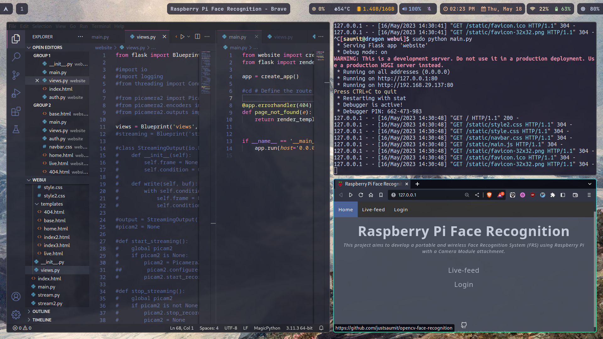

# .nu_dotfiles
Personal Arch Linux dotfiles for Wayland/Hyprland

## Installation guide
1. After a base install install Hyprland from pacman or via a AUR Helper
2. git clone [.nu_dotfiles](https://github.com/justsaumit/.nu_dotfiles)
3. Install waybar, foot terminal, imv, tofi and wpaperd  
4. Install the necessary fonts: ubuntu nerd mono, jetbrains nerd mono ,joypixels 
5. Copy/Replace the dotfiles

## Brief look / Workflow

## License
All the scripts in this repo come under GPLv3 License
